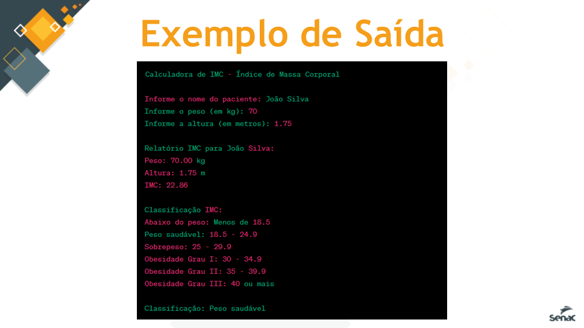

# Calculadora IMC 2023

## Descrição
Você foi designado para desenvolver um programa em C que
calcula o Índice de Massa Corporal (IMC) de um paciente,
classifica o resultado e exibe as informações em um formato fácil
de entender. O IMC é uma medida comum utilizada para avaliar
se uma pessoa está acima do peso, com peso saudável ou abaixo
do peso.

## Requisitos

1.O programa deve solicitar o nome do paciente;
2.Deve pedir o peso do paciente em quilogramas (kg);
3.Deve pedir a altura do paciente em metros (m);
4.O programa deve verificar se o peso e a altura inseridos são valores válidos (maiores que zero);
5.Deve calcular o IMC usando a fórmula: IMC = peso / (altura * altura);
6.O programa deve exibir o nome do paciente, o peso, a altura e o IMC com duas casas decimais;
7.Deve exibir uma tabela de classificação do IMC, indicando as faixas de valores para "Abaixo do peso", "Peso
saudável", "Sobrepeso", "Obesidade Grau I", "Obesidade Grau II" e "Obesidade Grau III“;
8.Deve classificar o IMC do paciente com base nas faixas de valores e exibir a classificação correspondente;
9.O programa deve ser capaz de lidar com vários pacientes em uma única execução

## Tela

